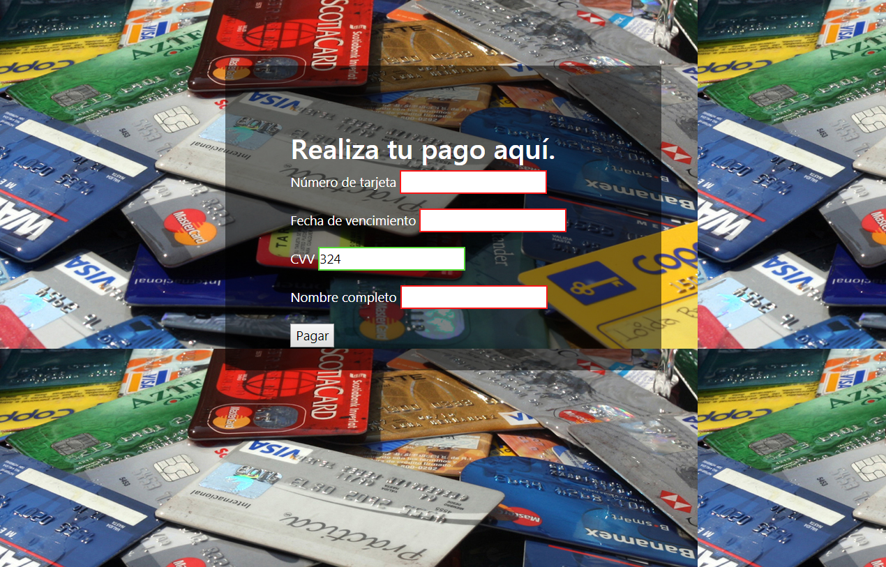

# Valida datos de tarjetas de crédito

---

Este proyecto es de una validación de tarjeta de crédito y sus datos de vigencia numero de seguridad y nombre de titular, en el cual al ingresar mal los datos muestra un recuadro rojo en el campo que no es correcto y aparece verde cuando esta bien el dato que se ingreso.

---

---
Desarrollado para Laboratoria.
